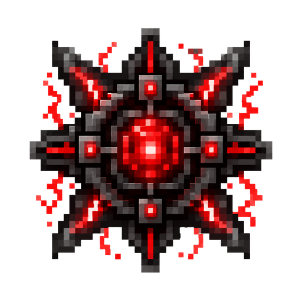

# 生电终结者（SDZJZ）

**抖音：乔大仙** · Minecraft 1.21.1 · Fabric

不会搭红石？照着教程都搭不对？——**合成机器，拖进画布，连几根线，材料自己长出来。**
用 ComfyUI 式的节点画布替代原版生电的巨型农场：面板即工厂，连线即物流。

## 一分钟上手
1. 原版工作台合成 **核心模块**（铜×4 + 红石×4 + 石英），再合成 **超大工作台** 与 **结构核心**、**存储核心**、**数据面板**
2. 打开 **超大工作台**（12×12）：右侧点机器 → 自动从背包填料 → 取走机器（刷怪类要先用**抓物笼子**去对应地方抓生物）
3. 放下 **结构核心**，手持机器右键放入（一次 1 台），空手右键打开**节点画布**
4. 画布顶部是**存储总线**（输出接口 / 存储1、2… / 数据面板1、2…）——把机器绿口**拖线**连到存储节点=定向入库
5. **开机**。产物进存储核心，打开数据面板（或**手持终端**远程开）查看/取用

## 系统一览
- **60+ 台机器**：刷石/刷铁/刷线/沼泽塔/女巫塔/守卫者/凋灵骷髅/旋风人塔（1.21）/农牧场/紫水晶/黏土/滴水石/造雪/玄武岩/钓鱼/唱片机……消耗与否**对齐原版**（原版免费的机器就免费）
- **抓物笼子**：右键活体生物捕获，38+ 种生物插画布刷掉落；也是刷怪机器的合成材料
- **万能熔炉 / 自动合成机**：接什么烧什么；选定目标量产一切有配方的物品（材料从网络自动扣）
- **节点画布**：无限节点、拖动/缩放/连线（按边精确路由）、状态灯（绿=运行 黄=阻塞 红=缺料）、右键菜单
- **逻辑节点四件套**：过滤器（白/黑名单分流）、数量传感器（库存阈值自动闸）、开关（手动闸）、分配器（多路均分）
- **连接三期**：数据线（自动连接式缆）→ 无线节点（48格）→ 卫星节点（跨维度全局）；数据链接器绑定聚合
- **存储体系**：存储核心（逻辑仓储·类型上限可升级·经验库）+ 数据面板（ME 式终端：中英文搜索/存量排序/右键选数量/3×3 合成/回收格/经验存取）
- **手持终端**：远程开面板；**自动补货**（打空自动补一组）；可**镶嵌自动喂食器**（自动吃选定食物）
- **升级体系**：加速/数量/并发，每台机器节点独立插装
- **村民系统**：繁殖机产合同 → 交易所就业/交易/治愈打折
- **经验**：刷怪/熔炼/交易累积经验池，画布领取；面板经验库跨核心存取

## 开发
- `./gradlew build`（JDK 21）；工作流/守则见 `HANDOVER.md`、`SKILL.md`，逐轮记录见 `DEVLOG.md`
- 设计文档：`DESIGN.md`、`完整设计文档.md`、`连接系统.md`、`量产覆盖.md`
